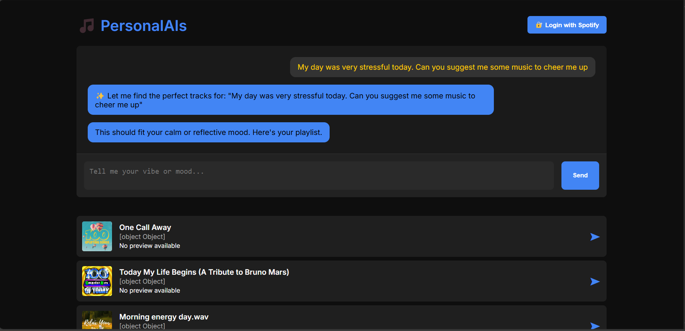

# 🎵 PersonalAIs - AI-Powered Music Recommender

Welcome to **PersonalAIs** — your intelligent music buddy!  
Just tell the app your mood, activity, or vibe, and it will recommend **personalized playlists** you’ll love.  
You can even **create playlists directly on your Spotify account**! 🎶

---

## 📜 Table of Contents
- [About](#about)
- [Tech Stack](#tech-stack)
- [Setup & Installation](#setup--installation)
- [Running the App](#running-the-app)
- [How Spotify Login Works](#how-spotify-login-works)
- [API Overview](#api-overview)
- [Frontend Walkthrough](#frontend-walkthrough)
- [Features](#features)
- [Credits](#credits)

---

## 📖 About

**PersonalAIs** is a full-stack music recommendation system that:
- Understands your **mood** and **activity** using **NLP**.
- Searches and ranks songs from **Spotify** based on emotional and semantic similarity.
- Remembers your **conversation history** and **preferences**.
- Lets you **create custom playlists** on your **own Spotify account**.
- Learns from your **feedback** over time!

---

## ⚙️ Tech Stack

- **Backend**: Python, FastAPI, SQLAlchemy, AsyncIO
- **ML/NLP Models**: 
  - Sentence Transformers (`all-MiniLM-L6-v2`)
  - Huggingface Emotion Detection (`distilbert-go-emotions`)
  - FAISS (vector similarity search)
- **Music Data**: Spotify Web API (`spotipy`)
- **Frontend**: 
  - Custom HTML/CSS Frontend
  - Streamlit App (optional)
- **Database**: Async SQLite (`aiosqlite`)
- **Authentication**: Spotify OAuth 2.0

---

## 🛠️ Setup & Installation

1. **Clone the repository**
   ```bash
   git clone https://github.com/your-username/PersonalAIs.git
   cd PersonalAIs
   ```

2. **Create a virtual environment**
   ```bash
   python -m venv env
   source env/bin/activate  # On Windows use `env\Scripts\activate`
   ```

3. **Install dependencies**
   ```bash
   pip install -r requirements.txt
   ```

4. **(No Spotify App Creation Needed!)**  
   The project already has a working Spotify App setup:
   ```
   client_id = "736bb144677e448dad56d2fe2ab70cd0"
   client_secret = "d7beffe6e8d740deb7e1ddd9a111c88f"
   redirect_uri = "http://127.0.0.1:8000/callback"
   ```
   So you can directly login and start using your own Spotify account!

---

## 🚀 Running the App

1. **Start the backend server**
   ```bash
   uvicorn main:app --reload
   ```

2. **Open the Frontend**
   - Open `frontend/index.html` in your browser.
   - (or use a simple static server like `python -m http.server`.)

3. **(Optional) Run the Streamlit App**
   ```bash
   streamlit run Streamlit_app.py
   ```

---

## 🔑 How Spotify Login Works

- Click the **🔐 Login with Spotify** button on the web page.
- Authenticate using **your personal Spotify account**.
- No setup needed — the app is pre-linked with Spotify.
- After login, you can:
  - Get music recommendations 🎵
  - Create playlists on your Spotify account 🎶
  - Save them directly from the chatbot!

> *You are always using your **own** Spotify — not the developer's account!*

---

## 📡 API Overview

| Endpoint | Method | Purpose |
|:---------|:-------|:--------|
| `/api/chat` | POST | Chat and get song recommendations |
| `/api/create_playlist` | POST | Create a playlist from recommended songs |
| `/api/feedback` | POST | Provide feedback (like/dislike) for better future suggestions |
| `/login` | GET | Start Spotify OAuth Login |
| `/callback` | GET | Spotify OAuth callback |

---

## 🎨 Frontend Walkthrough

- Users input **User ID** and **Mood/Activity**.
- Messages appear dynamically (User ↔ Bot).
- Recommended tracks display:
  - 🎵 Track Name
  - 🎤 Artist
  - ▶️ Play preview audio
  - 🔗 Spotify link
- Ability to **name your playlist** and create it directly.

---

## ✨ Features

- 🎧 Emotion and Activity-Based Song Recommendations
- 🧠 Smart Conversational Memory
- 🥳 Direct Spotify Playlist Creation
- 🧠 Learns From User Feedback
- ⚡ Async Fast Backend
- 🎨 Beautiful Custom Frontend
- 🚀 Easy to run — no environment variables or setup needed!

---

## 🤝 Credits

- **Developer**: Shantanu (IIT Bombay)
- **APIs and Tools**: Spotify, Huggingface, Sentence-Transformers, FAISS, FastAPI

---

# 🎉 Thank You for using PersonalAIs!
> *“Music is the shorthand of emotion.” – Leo Tolstoy*
>
> 
